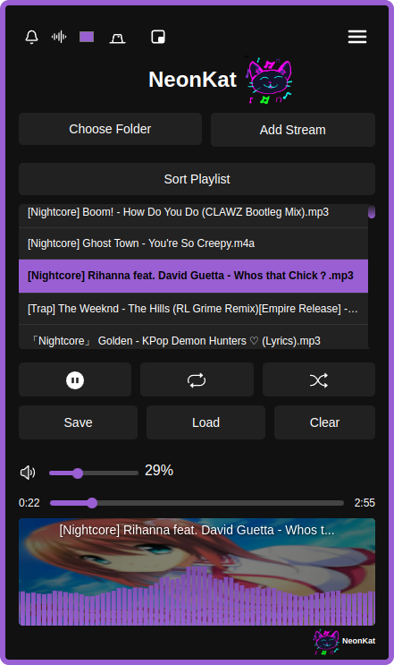
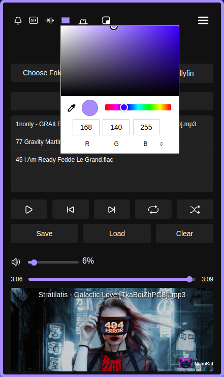
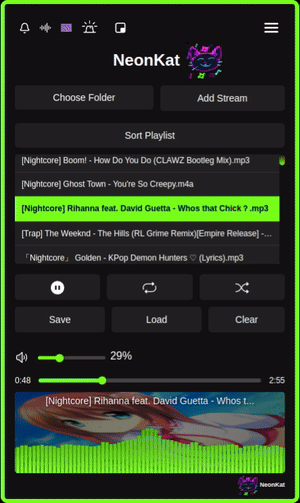
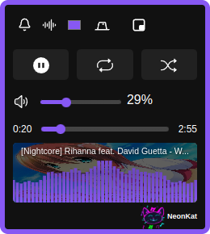
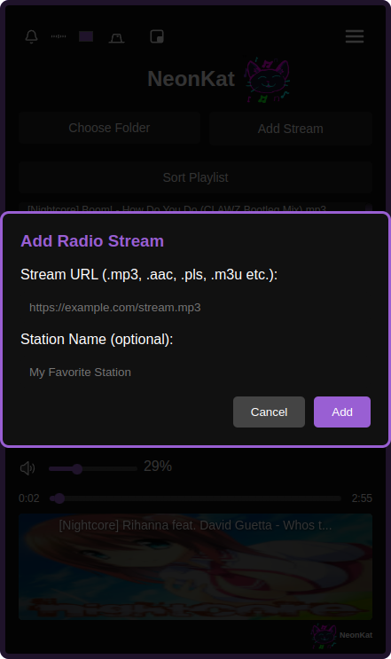
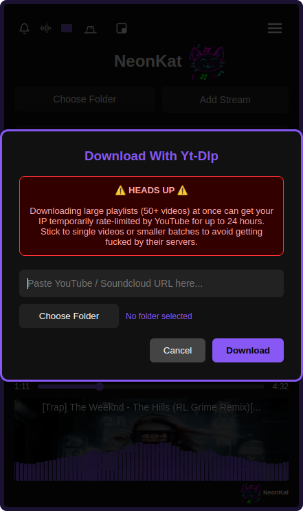
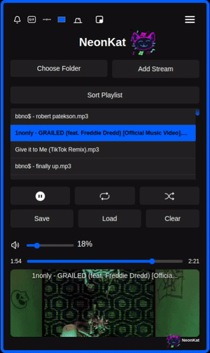
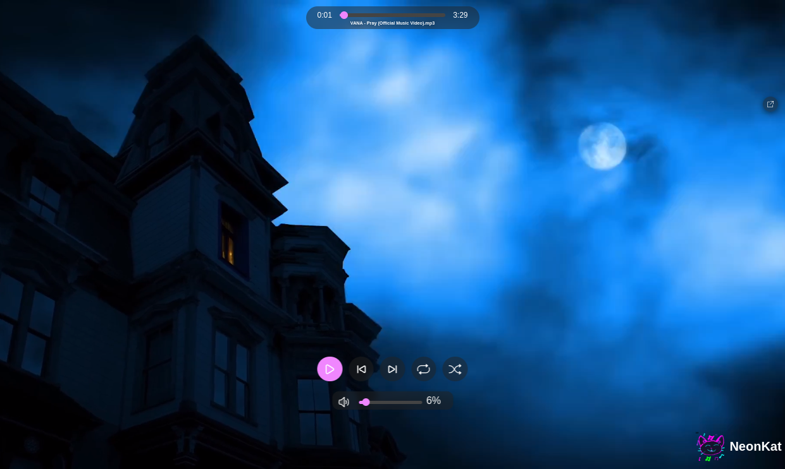

  

# NeonKat – Cross-Platform Electron Music Player

**NeonKat** is a lightweight, **cross-platform Electron music player** for Linux and Windows. It features **playlist management, a real-time music visualizer, an always-on-top miniplayer, and support for streaming from Jellyfin servers**. NeonKat runs entirely locally - no cloud, no tracking, your music stays on your device. Advanced features include **YT-dlp integration**, **radio streams**, **Neon Mode visualizations synced to the beat**, and **Canvas Mode short video previews**, similar to Spotify’s Canvas feature.  

NeonKat is perfect for users who want a **fast, private, and visually engaging music player** on Linux and Windows systems.

---

## 🛠️ Key Features
- **Playlist loading and saving**
- **Supports embedded and image / gif file cover art**: if you add a png / jpg to the song directory called cover.png / cover.gif it will draw for all the songs with no artwork. You can also have artwork matching the name of the song and it will load that for the corresponding song
- **Music visualizer**
- **Always on top mini mode**
- **Seek, volume, and other simple features you would expect from a music player**
- **YT-dlp support** (need to have yt-dlp and ffmpeg installed in your system path https://github.com/yt-dlp/yt-dlp/wiki/Installation - if using windows i recommend using scoop for this)
- **Radio streams support**
- **Neon Mode** (color changes to the beat)
- **Custom Picture In Picture Mode**
- **Custom Backgrounds** (local or url)
- **Canvas Mode** (short MP4 previews)
- **Supports Jellyfin servers for music streaming**
- **Auto Updates (disabled by default for privacy reasons)**
- **Zero outside connections** – your music and data stay with you.

---

## Previews

| Visualizer | Color Selector | Neon Mode |
|------------|----------------|-----------|
|  |  |  |

| Mini Mode | Radio Streams | YT-dlp Support | 
|-----------|---------------|----------------|
|  |  |  |

| Canvas Mode | Jellyfin Support | Custom Backgrounds |
|-------------|-------------|-------------|
|  |  |  |

| Custom Picture In Picture Mode|
|-------------|
|  |
---

## 🤗 Special Thanks
- Friends who helped with the artwork 
- [YT-dlp team](https://github.com/yt-dlp/yt-dlp) for their amazing project

---

## 💰 Support Development
`monero(xmr): 455KNy55xW9cK4sGknaHwEHD7s3RYcS1nb3bdACZVNpJDey47BegHWpjUghbPu64xxMi2fZwqG95wfextdwDcXbbALSDFVw`

---

## 🧑‍💻 Developer
- PaleCache
