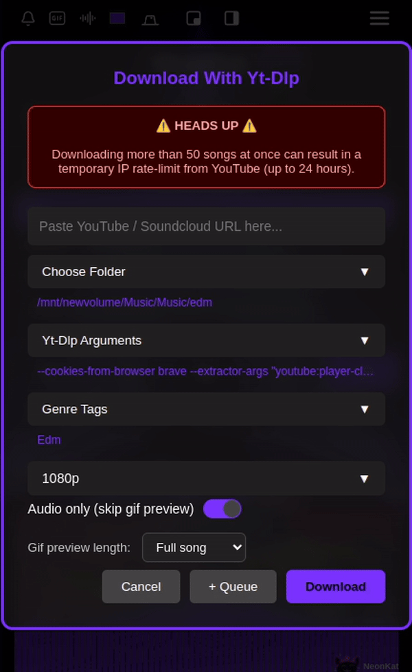
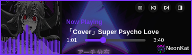

<p align="center">
  
</p>

# NeonKat – Cross-Platform Electron Music Player

**NeonKat** is a lightweight, **cross-platform electron music player** for Linux and Windows. It features **playlist management, a real-time music visualizer, an always-on-top miniplayer, and support for streaming from Jellyfin servers**. NeonKat runs entirely locally - no cloud, no tracking, your music stays on your device. Advanced features include **YT-dlp integration**, **radio streams**, **Neon Mode visualizations synced to the beat**, and **Canvas Mode short video previews**, similar to Spotify’s Canvas feature.  

NeonKat is perfect for users who want a **fast, private, and visually engaging music player** on Linux and Windows systems.

---

## 🛠️ Key Features
- **Playlist loading and saving**
- **Supports embedded and image / gif file cover art**: if you add a png / jpg to the song directory called cover.png / cover.gif it will draw for all the songs with no artwork. You can also have artwork matching the name of the song and it will load that for the corresponding song
- **Music visualizer**
- **Always on top mini mode**
- **Seek, volume, and other simple features you would expect from a music player**
- **YT-dlp support** (need to have yt-dlp and ffmpeg installed in your system path https://github.com/yt-dlp/yt-dlp/wiki/Installation - if using windows i recommend using scoop for this)
- **Radio streams support**
- **Neon Mode** (color changes to the beat)
- **Custom Picture In Picture Mode**
- **Widget Mode** (Good for obs)
- **Custom Backgrounds** (local or url)
- **Canvas Mode** (short MP4 previews)
- **Supports Jellyfin servers for music streaming**
- **Auto Updates (disabled by default for privacy reasons)**
- **Zero outside connections** – your music and data stay with you.

---

## 📥 Installation

### Windows
Simply launch the `setup.exe` file. The installer will guide you through the process.

### Linux

#### Option 1: Install the application (recommended)

1. Download the source code and the `.AppImage` from the release page.
2. Place the `.AppImage` file into the `dist` folder.
3. Open a terminal in the project directory.
4. Make the installation script executable:
   ```bash
   chmod +x install.sh
   ```
5. Run the installer:
   ```bash
   ./install.sh
   ```

#### Option 2: Run the AppImage directly

If you prefer not to install the application, you can run the AppImage directly:

1. Make the AppImage executable:
   ```bash
   chmod +x NeonKat-<version number>-x86_64.AppImage
   ```
2. Launch it:
   ```bash
   ./NeonKat-<version number>-x86_64.AppImage
   ```

> **Note:** On some Linux distributions, you can also right click the AppImage, open **Properties -> Permissions**, and enable **"Allow executing file as a program"** before launching it.


## Previews

| Visualizer | Color Selector | Neon Mode |
|------------|----------------|-----------|
|  |  |  |

| Mini Mode | Radio Streams | YT-dlp Support | 
|-----------|---------------|----------------|
|  |  |  |

| Canvas Mode | Jellyfin Support | Custom Backgrounds |
|-------------|-------------|-------------|
|  |  |  |

| Custom Picture In Picture Mode|
|-------------|
|  |

| Widget Mode|
|-------------|
|  |
---

## 🤗 Special Thanks
- Friends who helped with the artwork 
- [YT-dlp team](https://github.com/yt-dlp/yt-dlp) and the [FFmpeg team](https://github.com/FFmpeg/FFmpeg) <br> for their amazing projects, none of this would be possible without them <3 

---

## 💰 Support Development
`monero(xmr): 455KNy55xW9cK4sGknaHwEHD7s3RYcS1nb3bdACZVNpJDey47BegHWpjUghbPu64xxMi2fZwqG95wfextdwDcXbbALSDFVw`

---

## 🧑‍💻 Developer
- PaleCache
